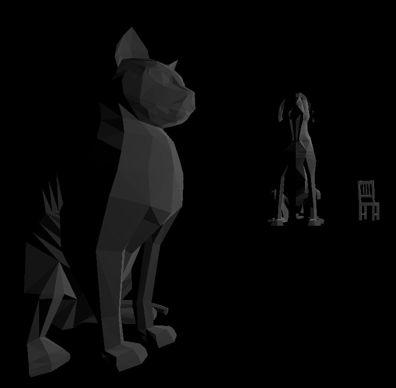

# LAB 2
 
https://drive.google.com/file/d/1YgN9H7Y9Awm4uuTu5_H3r4loBqRFCW0U/view?usp=sharing

# LAB 3
https://drive.google.com/file/d/1dwz_3lqLe29I6bn_IlewkWAUJOmxdsOT/view?usp=sharing
Cube0: I used a wireframe with the interpolated colors  
Cube1: I followed the tutorial and made a interpolated gradient style cube  
Cube2: The material is decorated using the specular and shiny variables  
Cube3: The material is decorated using the specular and shiny variables however I also added a   wireframe to it using the linecap setting "square"  

# LAB 4
24 A: X = (7U)  
24 B: y = 7(1-v)  
24 C: Gray  
From Left to Right  
Cube 1: I used a non corresponding normal map and texture to create a uniquely lighted texture  
Cube 2: I applied 156.JPG to a cube  
Cube 3: I applied the corresponding normal map to the 156.JPG texture to create a differently lighted texture  
Cube 4: I used the Frag and Vertex shader to light up a 176.JPG texture  
Cube 5: I used the same 176.jpg texture because it is easy to look at when tiling, I tiled it by setting the wrapping condition to 'Repeating' and I multiplied the uVu variable inside the Frag Shader by 2.0 to make it divide into quadrants on each face  
https://drive.google.com/open?id=1F_F_SYucTUacOFQQh9UFv1aWPB859lUP  